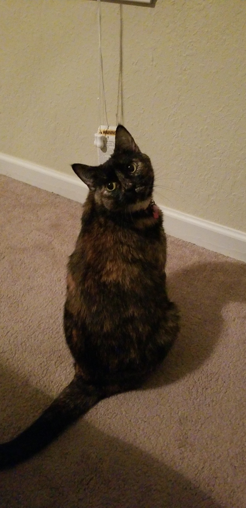

# Markdown Basics #

### Understanding Markdown ###
Markdown is a form of plain text editor that is designed to be able to convert the plain text into many formats, including HTML. Markdown is relatively simple to learn to use, it just takes some getting used to.

Markdown is not like using a word processor, so you will have to learn how to adjust to certain characters having different uses than in programs like Microsoft word. However, once you get used to this, you will be able to use Markdown to create rich text from plain text.

### How to use Markdown ###
Markdown is fairly simple to learn how to use, you just have to learn to understand which keys in which order will give you what you want. Below I will show you how to get markdown to do what you want.
***
### Block quotes ###
First things first, for much of the rest of this tutorial I will be writing in "block text" or "block quotes." The reason for this is that in order to show you how to create something without actually creating it, I need to let markdown know that I just want those characters.
> Block text will look like this whenever you create them. Now, in order to create block text all you have to do is hit the > key at the beginning of your quote.
>After you type that quote, you may want to be done with the block quote, so you hit the enter key. The issue being that once you keep typing, not only is it still a block quote, but it continuing in the same block quote as before. In order to fully exit the block quote, make sure to hit the enter key twice to ensure that the > marker is not in front of where you are about to start typing.

***
### Headers ###
Now that we have gotten block quotes out of the way, let's talk about headers. You have seen me use headers already in this document, but you may not have noticed it. Headers are the larger, bold text that I have been using to create a title for each new section. Now, there's no button to just bold or even make your text larger. However, using headers easily resolves this issue.
> To use a header, all you have to do is put "#" then space, before your title. You do not have to include the "#" after the title, but I like to because it looks nicer. In order to stop typing in the header style, you can just hit the enter key. In order to change the size of you title, all you have to do is add more "#". The more of these that you have, the smaller your header will be. 

Examples: 
# H1 #
## H2 ##
### H3 ###
#### H4 ####
***
### Horizontal Rule ###
Horizontal rule is useful for keeping things looking clean. The horizontal rule is the line that runs horizontally across the page that I have been using to divide up my sections.
> Horizontal rule can be done in several ways. Just remember the magic number 3. to make a horizontal rule you can 3 underscores, hyphens or asterisks. So that would look like "___" or "---" or "***".

***
### Bold and Italics ###
Another pretty simple tactic to make your Markdown project look better is to add emphasis. Emphasis can be done by using *italics* and **bold text**.
> In order to make italicized words, all you need to do is put a single asterisk
>"*" or a single underscore before and after what should
be italicized. In order to create bold text all you need to do is a double asterisk "**" or double underscore before and after what should be bolded.

***
### Lists ###
A list can be useful in order to organize information. These lists can be ordered or unordered, depending on the situation. 
> To make a numbered or ordered list, all you have to do is type "1." followed by a space, then whatever number 1 is on the list. Then, whenever you push enter it will add the next number onto that list. When making an unordered list, you have a few different options. You can use a single asterisk "*", minus "-" or plus "+". Once you are done with the list, you can hit enter twice to exit, just insure that you don't have an extra number of symbol hanging off the end.

1. Don't
2. do
3. this
4. 

***

### Tables ###
Tables may be something that you may be interested in doing. They do look a little weird when making them in markdown, but they should render out nicely.
> To make a table is a tad difficult to explain. The best description is to just map out how it should look. I will demonstrate this below.

>|This |is |how |(enter)
|-----|---|----|(enter)
|the  |table |is|(enter)
|made |fairly |easily|(enter)

>Where I put (enter) you will hit the enter key in order to start a new line. Also be sure that you have at least 3 of the hyphens "-" that you use to separate the titles from the rest table in each section. Making the table is not incredibly difficult, but it certainly looks messy, and for some reason Markdown does not like to show the proper output, but rest assured that if you do it properly, it will be correct on your webpage. Below is how my table would look.

|This |is |how |
|-----|---|----|
|the  |table |is|
|made |fairly |easily|

***
### Adding Picture ###
Adding pictures is one struggle that I had when learning Markdown. Honestly still have some struggles. In general, to use a picture that is stored on you computer it is best to have that picture in the same folder as your Markdown document, then call it, like so:
> first use an exclamation point "!", then an open and close bracket "[]" followed by the name of the image "(Kali.jpg)". Do all this without spaces.

For a better explanation or example of this, you can follow this link [here](<https://github.com/adam-p/markdown-here/wiki/Markdown-Cheatsheet#images>) or [here](<https://daringfireball.net/projects/markdown/syntax#img>).

Just in case that is a bit overwhelming, here is a picture of my cat, Kali.

***
### Links ###
Lastly, I will show you how to link to external websites, which can include linking to online pictures if you would like.
> My favorite way to make a link to an external website is to first use brackets "[]" around the word that I want to carry the link. This word could be "here" or "this" or literally any word you want it to be. After you have your word, you just need to copy and paste your link inside a set of parentheses "()". Once you have that done, it will like something like this: "[Google]_(<https://www.google.com/>)" only without the underscore in between.

If you need some additional help with this step you can checkout [this page](<https://github.com/adam-p/markdown-here/wiki/Markdown-Cheatsheet#links>) or [this page](<https://daringfireball.net/projects/markdown/syntax#link>).

If neither of those links are very good, this page [here](<https://www.youtube.com/watch?v=dQw4w9WgXcQ>) has never let me down.
***
So, that is a fairly basic introduction of how to use Markdown. Of course, Markdown is capable of a lot more than I have listed here, but at least now you have a general idea of how to get started with your Markdown project. At the very bottom of this page I will add links that helped me learn how to use Markdown. Have fun and good luck!

Tutorial by [Adam Pritchard](https://github.com/adam-p/markdown-here/wiki/Markdown-Cheatsheet#)
Tutorial by [John Gruber](<https://daringfireball.net/projects/markdown/>)

To return to the home screen, click [here](<https://github.com/StevenVaughan97/Markdown-Tutorial/blob/master/README.md>)